# 🦷 Airodental Platform: Billing & Entitlement System Technical Architecture

---

## 📋 Table of Contents

- [1. Introduction](#1-introduction)
- [2. Core System Components](#2-core-system-components)
- [3. Database Schema](#3-database-schema-billing--entitlement-focus)
- [4. Key Billing & Entitlement Flows](#4-key-billing--entitlement-flows)
- [5. API Interaction Summary](#5-api-interaction-summary-conceptual)
- [6. Data Integrity and Synchronization](#6-data-integrity-and-synchronization)
- [7. Security Considerations](#7-security-considerations)

---

## 1. Introduction

> **The Airodental Platform serves as the central hub for managing a suite of specialized AI-driven applications tailored for dental practices.**

### 🎯 Overview

A core component of this platform is the sophisticated **Billing & Entitlement Management System (BEMS)**, designed to handle:

- 🔄 Product subscriptions
- ⚡ Feature entitlements  
- 📊 Real-time usage tracking
- 🤖 Automated resource provisioning

This document outlines the technical architecture of this system, operating within Airodental's **monorepo (Turborepo)** environment.

### 💡 Example Use Case

The system is exemplified by its management of applications like **"Lane,"** an AI Voice Receptionist, which offers:

- 📦 Tiered plans (e.g., "Lane Lite," "Lane Pro")
- ⏱️ Included monthly voice minutes  
- 🔄 Automated minute-pack top-up mechanism

---

## 2. Core System Components

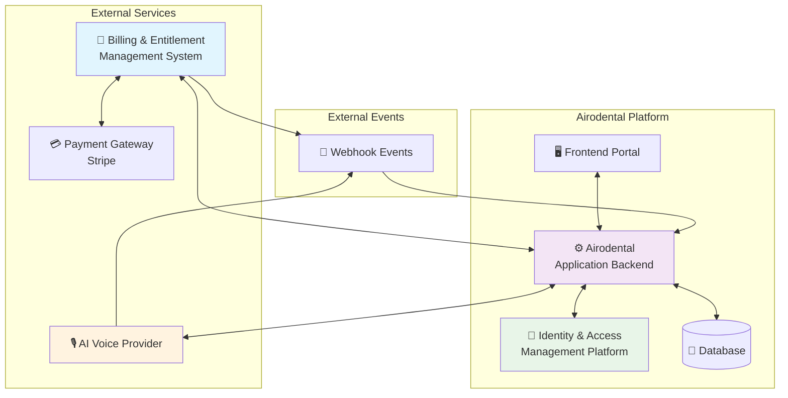

### 2.1. 🔐 Identity & Access Management (IAM) Platform

**Core Responsibilities:**
- 👤 User authentication
- 🏢 Organization structuring  
- 🛡️ Role-based access control
- 🆔 Unique identifier provision for billing linkage

---

### 2.2. 🏢 Billing & Entitlement Management System (BEMS)

> **The cornerstone of Airodental's commercial operations**

#### 📋 Key Features

| Feature | Description |
|---------|-------------|
| **📦 Product Catalog Management** | Defining service offerings like "Lane Lite," "Lane Pro," and "Minute Top-up Packs" |
| **🔄 Subscription Lifecycle** | Complete lifecycle management (creation → cancellation) |
| **⚖️ Feature Entitlement & Balance Tracking** | Managing feature access and consumption tracking |
| **🔌 Service APIs** | Comprehensive API suite for backend integration |
| **📡 Webhook Egress** | Real-time event notifications |

#### 🔌 API Capabilities

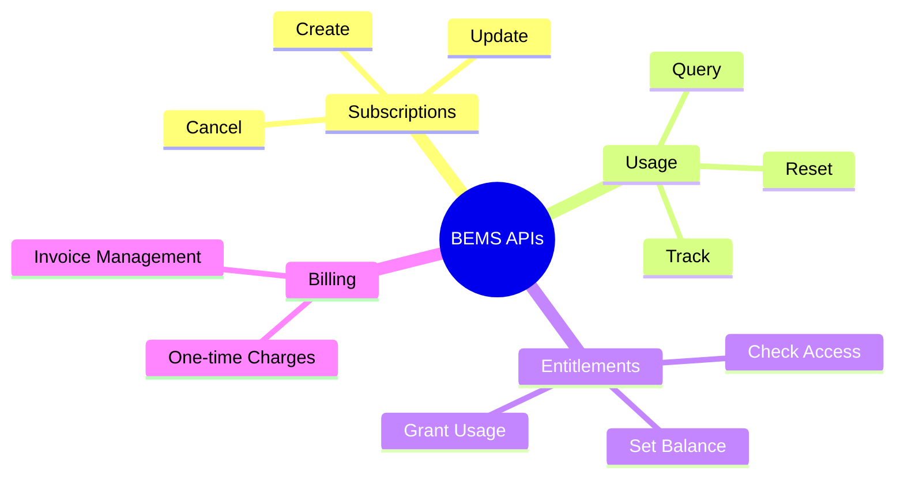

---

### 2.3. 🎙️ AI Voice Provider

**External service providing AI-driven voice communication capabilities**

#### Core Functions:
- 🚀 **Provisioning:** Individual AI assistant instances per organization
- 📞 **Processing:** Real-time call handling
- 📊 **Reporting:** Usage data via webhook events

#### Event Flow:
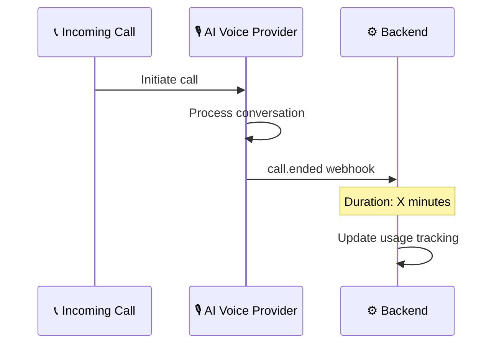

---

### 2.4. ⚙️ Airodental Application Backend

**The central orchestrator within the Airodental monorepo**

#### 🎯 Key Functions:

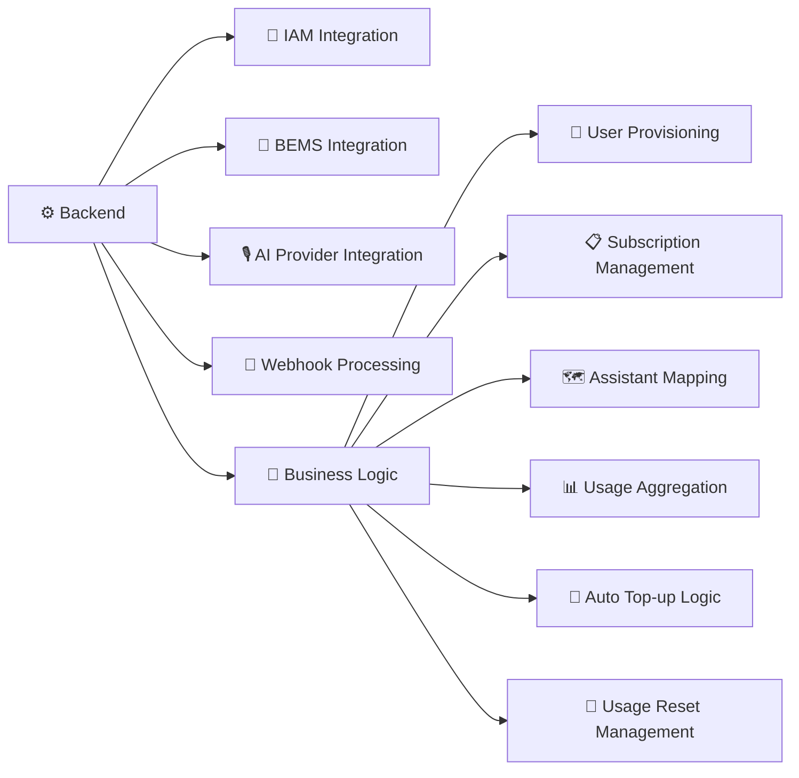

---

## 3. Database Schema (Billing & Entitlement Focus)

> **Simplified schema highlighting key billing and entitlement tables**

### 📊 Entity Relationship Diagram

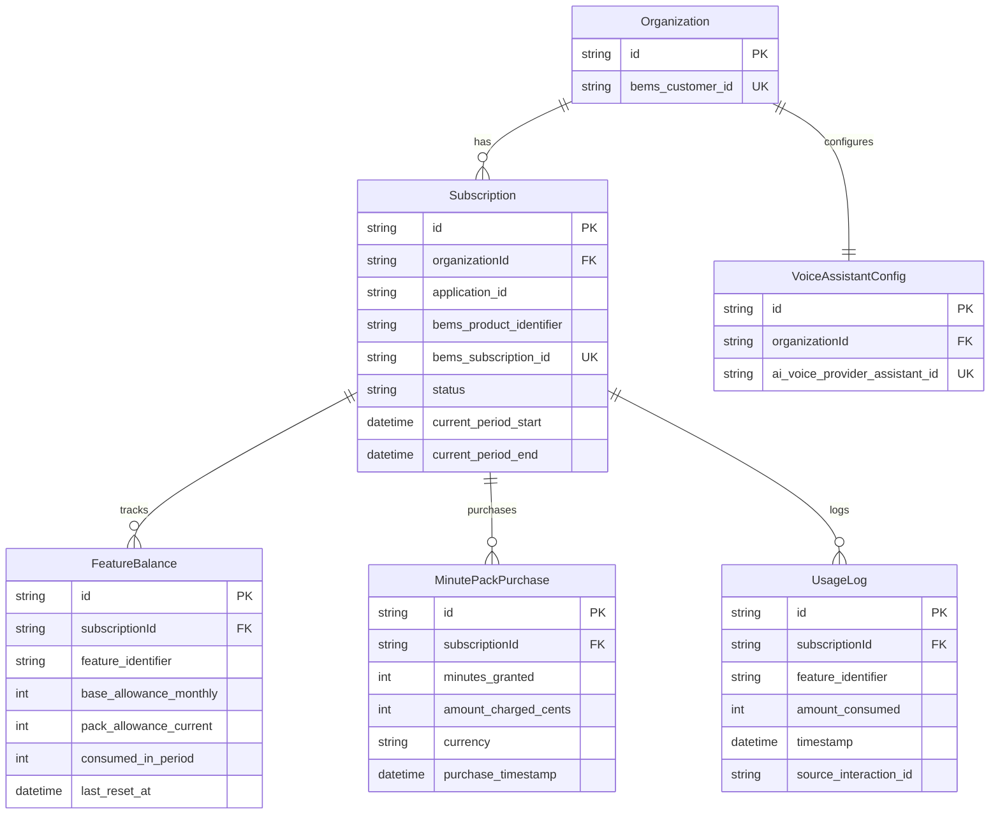

### 🗂️ Prisma Schema Definition

```prisma
// 🗃️ Airodental's Prisma Schema - Billing & Entitlement Focus

model Organization {
  id                  String    @id @default(cuid()) // 🆔 Primary Airodental Org ID
  bems_customer_id    String    @unique             // 🔗 Maps to customer ID in BEMS
  // ... other organization fields
  subscriptions       Subscription[]
  
  @@map("organizations")
}

model Subscription {
  id                      String    @id @default(cuid())
  organizationId          String
  organization            Organization @relation(fields: [organizationId], references: [id])
  
  // 📱 Application Configuration
  application_id          String    // e.g., "lane", "scheduler_app"
  bems_product_identifier String    // e.g., "lane_lite_monthly_v1"
  bems_subscription_id    String    @unique
  
  // 📊 Status & Billing Cycle
  status                  String    // "active", "past_due", "canceled"
  current_period_start    DateTime
  current_period_end      DateTime
  
  // 🔗 Related Records
  feature_balances        FeatureBalance[]
  minute_pack_purchases   MinutePackPurchase[]
  usage_logs              UsageLog[]
  
  @@map("subscriptions")
}

model FeatureBalance {
  id                      String      @id @default(cuid())
  subscriptionId          String
  subscription            Subscription @relation(fields: [subscriptionId], references: [id])
  
  // 🎯 Feature Configuration
  feature_identifier      String      // "voice_minutes", "premium_reports"
  base_allowance_monthly  Int         // 📦 Base plan allowance
  pack_allowance_current  Int         @default(0) // 🎁 Additional from packs
  consumed_in_period      Int         @default(0) // 📊 Current usage
  last_reset_at           DateTime    // 🔄 Last reset timestamp
  
  @@unique([subscriptionId, feature_identifier])
  @@map("feature_balances")
}

model UsageLog {
  id                      String    @id @default(cuid())
  subscriptionId          String
  subscription            Subscription @relation(fields: [subscriptionId], references: [id])
  
  // 📊 Usage Details
  feature_identifier      String
  amount_consumed         Int
  timestamp               DateTime  @default(now())
  source_interaction_id   String?   // 🔗 e.g., AI Voice Provider Call ID
  notes                   String?
  
  @@map("usage_logs")
}

model MinutePackPurchase {
  id                      String    @id @default(cuid())
  subscriptionId          String
  subscription            Subscription @relation(fields: [subscriptionId], references: [id])
  
  // 💰 Purchase Details
  minutes_granted         Int
  amount_charged_cents    Int
  currency                String    @default("USD")
  bems_charge_identifier  String?   // 🔗 Payment processor charge ID
  purchase_timestamp      DateTime  @default(now())
  
  @@map("minute_pack_purchases")
}

model VoiceAssistantConfig {
  id                             String    @id @default(cuid())
  organizationId                 String    @unique
  ai_voice_provider_assistant_id String    @unique
  
  // ... other configuration fields
  
  @@map("voice_assistant_configs")
}
```

---

## 4. Key Billing & Entitlement Flows

### 4.1. 🚀 New Application Subscription (e.g., "Lane")

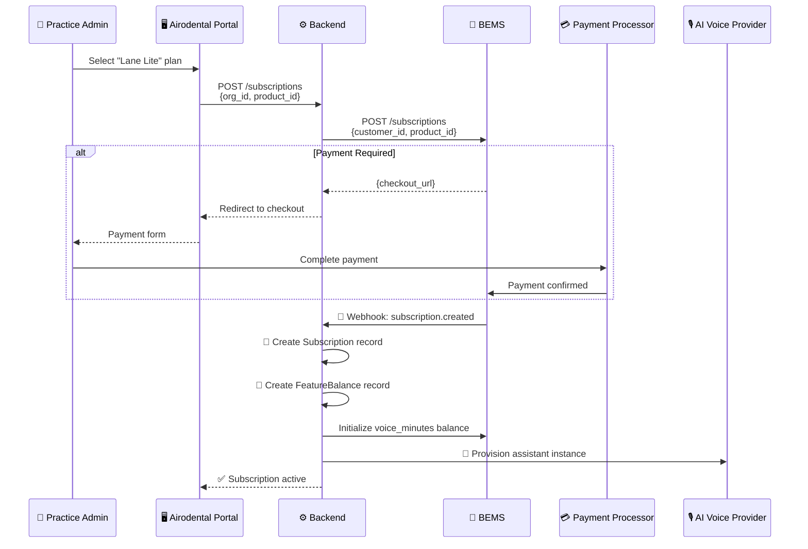

#### 📋 Detailed Steps:

1. **👤 User Action:** Practice admin selects plan (e.g., "Lane Lite")

2. **⚙️ Backend Processing:**
   ```typescript
   // Request structure
   {
     organization_id: "org_abc123",
     bems_product_identifier: "lane_lite_monthly_v1"
   }
   ```

3. **🏢 BEMS Integration:** Creates subscription with payment processor

4. **💳 Payment Flow:** Secure checkout process

5. **📡 Webhook Processing:** Handles `subscription.created` event

6. **💾 Database Updates:**
   - Create `Subscription` record
   - Initialize `FeatureBalance` (700 minutes for Lane Lite)
   - Set usage counters to zero

7. **🚀 Service Provisioning:** AI assistant instance creation

---

### 4.2. 📊 Usage Tracking (e.g., "Lane" Voice Call Minutes)

```mermaid
sequenceDiagram
    participant Call as 📞 Patient Call
    participant AI as 🎙️ AI Voice Provider
    participant Backend as ⚙️ Backend
    participant BEMS as 🏢 BEMS
    
    Call->>AI: Incoming call
    AI->>AI: Handle conversation
    AI->>Backend: 📡 Webhook: call.ended<br/>{duration, assistant_id}
    
    Backend->>Backend: 📊 Calculate minutes (rounded up)
    Backend->>Backend: 🔍 Find organization & subscription
    Backend->>BEMS: 📈 Track usage<br/>POST /usage/track
    
    parallel
        Backend->>Backend: 💾 Create UsageLog entry
    and
        Backend->>Backend: 📊 Update FeatureBalance.consumed
    end
    
    Backend->>Backend: 🔍 Check if auto top-up needed
```

#### 🔧 Implementation Details:

```typescript
// Webhook payload structure
interface CallEndedPayload {
  call_id: string;
  assistant_id: string;
  start_timestamp: number;
  end_timestamp: number;
  duration_seconds: number;
}

// Usage calculation
const minutes = Math.ceil(duration_seconds / 60);
```

---

### 4.3. 🔄 Automated Minute Pack Top-Up

> **Seamless service continuation through intelligent top-up automation**

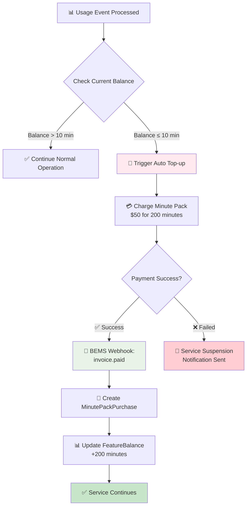

#### 📋 Process Flow:

1. **📊 Balance Check:**
   ```typescript
   const balance = await BEMS.getBalance(customer_id, 'voice_minutes');
   const threshold = 10; // configurable low-water mark
   
   if (balance <= threshold) {
     await initiateTopUp();
   }
   ```

2. **💳 Automated Purchase:**
   ```json
   {
     "customer_id": "cust_abc123",
     "product_id": "minute_pack_200_usd50",
     "quantity": 1
   }
   ```

3. **📡 Webhook Confirmation:** Process `invoice.paid` event

4. **💾 Database Updates:**
   - Create `MinutePackPurchase` record
   - Update `FeatureBalance.pack_allowance_current += 200`

---

### 4.4. 🔄 Monthly Subscription Renewal & Minute Reset

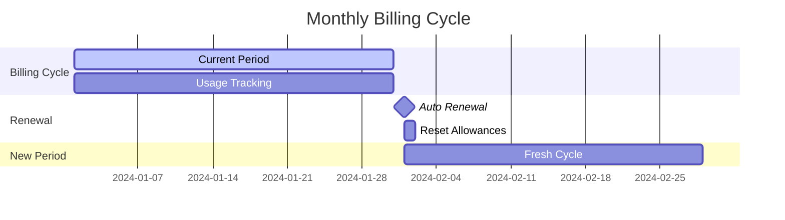

#### 🔄 Renewal Process:

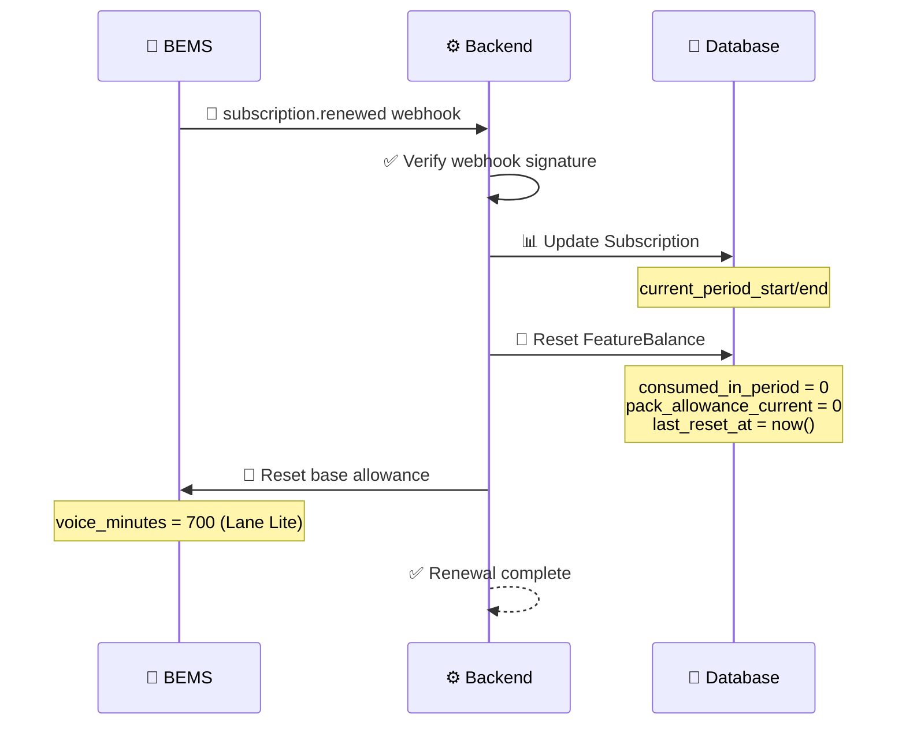

---

## 5. API Interaction Summary (Conceptual)

### 5.1. 🔌 Airodental Backend ↔ BEMS

#### 📤 Outbound API Calls

| Endpoint | Method | Purpose | Example Payload |
|----------|--------|---------|-----------------|
| `/api/bems/subscriptions` | `POST` | Create subscription | `{"customer_id": "cust_123", "product_id": "lane_lite"}` |
| `/api/bems/usage/track` | `POST` | Report usage | `{"customer_id": "cust_123", "feature_id": "voice_minutes", "value": 5}` |
| `/api/bems/customers/{id}/entitlements/{feature}` | `GET` | Check balance | - |
| `/api/bems/customers/{id}/balances` | `POST` | Set balance | `{"feature_id": "voice_minutes", "balance": 700}` |
| `/api/bems/charges` | `POST` | One-time charge | `{"customer_id": "cust_123", "amount_cents": 5000}` |

#### 📥 Webhook Events

```typescript
// Event types from BEMS
interface BEMSWebhookEvents {
  'invoice.paid': InvoicePaidEvent;
  'invoice.payment_failed': PaymentFailedEvent;
  'subscription.created': SubscriptionCreatedEvent;
  'subscription.updated': SubscriptionUpdatedEvent;
  'subscription.renewed': SubscriptionRenewedEvent;
  'subscription.canceled': SubscriptionCanceledEvent;
}
```

---

### 5.2. 🎙️ AI Voice Provider → Airodental Backend

#### 📡 Webhook Events

```typescript
interface VoiceProviderEvents {
  'call.started': {
    call_id: string;
    assistant_id: string;
    start_timestamp: number;
  };
  
  'call.ended': {
    call_id: string;
    assistant_id: string;
    start_timestamp: number;
    end_timestamp: number;
    duration_seconds: number;
    // Additional call metadata...
  };
}
```

---

## 6. Data Integrity and Synchronization

> **Ensuring consistency between Airodental's database and external systems**

### 🛡️ Core Principles

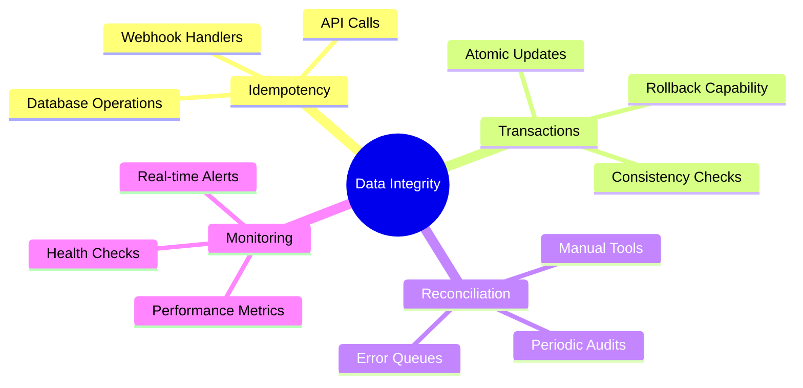

### 🔄 Idempotent Webhook Handlers

```typescript
// Example idempotent webhook handler
async function handleSubscriptionCreated(payload: WebhookPayload) {
  const { subscription_id } = payload;
  
  // Check if already processed
  const existing = await db.subscription.findUnique({
    where: { bems_subscription_id: subscription_id }
  });
  
  if (existing) {
    logger.info(`Subscription ${subscription_id} already processed`);
    return; // Idempotent - no duplicate processing
  }
  
  // Transactional processing
  await db.$transaction(async (tx) => {
    await tx.subscription.create({ /* ... */ });
    await tx.featureBalance.create({ /* ... */ });
  });
}
```

### 📊 Reconciliation Strategies

| Strategy | Frequency | Purpose |
|----------|-----------|---------|
| **🔍 Periodic Audits** | Daily | Compare key metrics between systems |
| **🔧 Manual Tools** | On-demand | Admin-triggered synchronization |
| **⚠️ Error Queues** | Real-time | Retry failed operations |
| **📈 Health Checks** | Continuous | Monitor system consistency |

---

## 7. Security Considerations

### 🔒 Security Framework

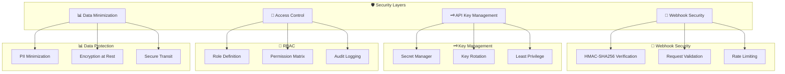

### 🔐 Implementation Details

#### Webhook Security
```typescript
// HMAC signature verification
function verifyWebhookSignature(payload: string, signature: string, secret: string): boolean {
  const expectedSignature = crypto
    .createHmac('sha256', secret)
    .update(payload)
    .digest('hex');
    
  return crypto.timingSafeEqual(
    Buffer.from(signature, 'hex'),
    Buffer.from(expectedSignature, 'hex')
  );
}
```

#### Access Control Matrix
| Role | Billing Data | Admin Functions | User Data |
|------|--------------|-----------------|-----------|
| **Super Admin** | ✅ Full Access | ✅ All Functions | ✅ All Organizations |
| **Org Admin** | ✅ Own Org Only | ❌ Limited | ✅ Own Org Only |
| **User** | ❌ Read Only | ❌ None | ✅ Own Data Only |

---

### 📚 Additional Resources

For implementation details and extended documentation, refer to:

- 📖 [BEMS API Documentation](./docs/bems-api.md)
- 🎙️ [AI Voice Provider Integration Guide](./docs/voice-provider.md)
- 🔧 [Deployment & Operations Manual](./docs/deployment.md)
- 🧪 [Testing Strategy](./docs/testing.md)

---

**📝 Document Version:** 2.0  
**🗓️ Last Updated:** December 2024  
**👥 Maintainers:** Airodental Platform Team