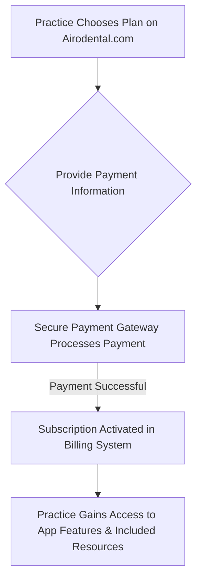
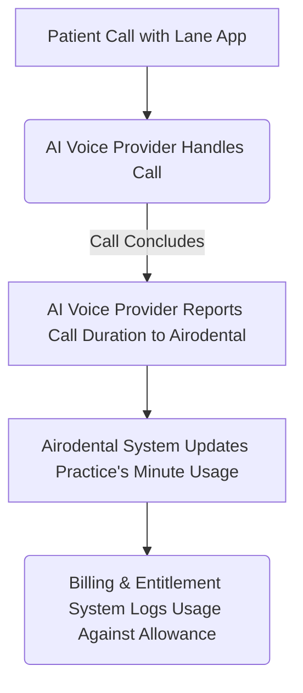
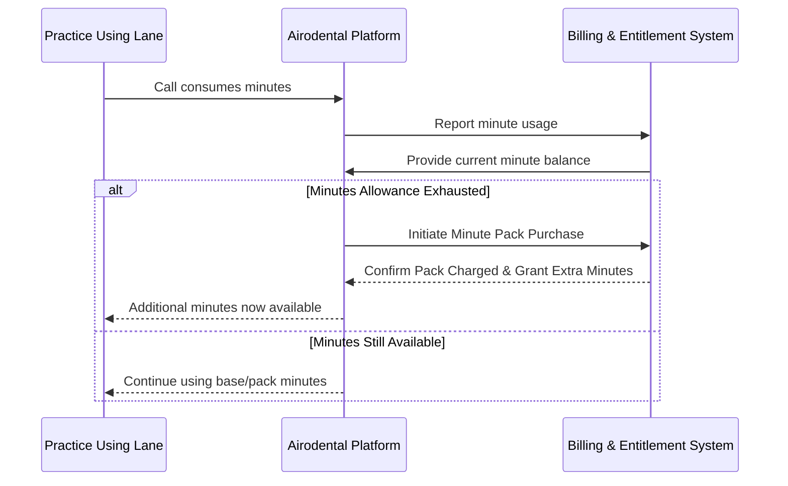

# Airodental Platform: Billing & Entitlement System Technical Architecture

## 1. Introduction

The Airodental Platform serves as the central hub for managing a suite of specialized AI-driven applications tailored for dental practices. A core component of this platform is the sophisticated Billing & Entitlement Management System (BEMS), designed to handle product subscriptions, feature entitlements, real-time usage tracking, and automated resource provisioning. This document outlines the technical architecture of this system, operating within Airodental's monorepo (Turborepo) environment.

The system is exemplified by its management of applications like "Lane," an AI Voice Receptionist, which offers tiered plans (e.g., "Lane Lite," "Lane Pro") with included monthly voice minutes and an automated minute-pack top-up mechanism.

## 2. Core System Components

The billing and entitlement architecture comprises several key interacting components:

### 2.1. Identity & Access Management (IAM) Platform
Responsible for user authentication, organization structuring, and role-based access control. It provides unique identifiers for users and organizations, which are fundamental for linking entities to their respective billing accounts and entitlements within the BEMS.

### 2.2. Billing & Entitlement Management System (BEMS)
This external, specialized system is the cornerstone of Airodental's commercial operations. Its responsibilities include:
*   **Product Catalog Management:** Defining and managing service offerings, such as "Lane Lite," "Lane Pro," and "Minute Top-up Packs," including their pricing, recurring intervals, and associated features.
*   **Subscription Lifecycle Management:** Orchestrating the entire subscription lifecycle (creation, activation, renewal, upgrades, downgrades, cancellation) through robust integration with an underlying payment processing gateway (e.g., Stripe).
*   **Feature Entitlement & Balance Tracking:** Managing entitlements to specific features (e.g., `voice_minutes` for the "Lane" application) and tracking their consumption and available balances for each subscribed organization.
*   **Service APIs:** Exposing a set of APIs for the Airodental backend to:
    *   Initiate subscription checkouts.
    *   Query feature access and current balances (`check_entitlement`).
    *   Report feature usage (`track_usage`).
    *   Adjust feature balances directly (`set_balance` or `grant_usage`).
    *   Process one-time charges for add-ons like minute packs.
*   **Webhook Egress:** Emitting events (e.g., `invoice.paid`, `subscription.renewed`) to notify the Airodental platform of significant billing lifecycle events.

### 2.3. AI Voice Provider
An external service providing the core AI-driven voice communication capabilities for applications like "Lane." It is responsible for:
*   Provisioning and configuring individual AI assistant instances per subscribed organization.
*   Handling real-time call processing.
*   Emitting webhook events (e.g., `call.ended`) to the Airodental backend, providing critical data for usage metering, such as call start and end times.

### 2.4. Airodental Application Backend
The central orchestrator within the Airodental monorepo. Its key functions include:
*   Serving as the intermediary between the IAM Platform, BEMS, and the AI Voice Provider.
*   Hosting secure webhook endpoints to receive and process events from both the BEMS and the AI Voice Provider.
*   Implementing core business logic for:
    *   User and organization provisioning.
    *   Subscription initiation and management flows.
    *   Mapping AI Voice Provider assistant instances to Airodental organizations/subscriptions.
    *   Aggregating usage data (e.g., call minutes).
    *   Implementing the automated minute pack top-up logic.
    *   Managing and resetting local records of periodic usage and allowances.

## 3. Database Schema (Billing & Entitlement Focus)

The following simplified schema outlines key tables and fields within the Airodental platform's database, pertinent to billing and entitlements.

```prisma
// Relevant subset of Airodental's Prisma Schema

model Organization {
  id                  String    @id @default(cuid()) // Primary Airodental Org ID
  bems_customer_id    String    @unique // Maps to customer ID in BEMS
  // ... other organization fields
  subscriptions       Subscription[]
}

model Subscription {
  id                      String    @id @default(cuid())
  organizationId          String
  organization            Organization @relation(fields: [organizationId], references: [id])
  application_id          String    // e.g., "lane", "scheduler_app"
  bems_product_identifier String    // Identifier for the plan in BEMS (e.g., "lane_lite_monthly_v1")
  bems_subscription_id    String    @unique // Subscription ID from BEMS
  status                  String    // e.g., "active", "past_due", "canceled"
  current_period_start    DateTime
  current_period_end      DateTime
  feature_balances        FeatureBalance[]
  minute_pack_purchases   MinutePackPurchase[]
  usage_logs              UsageLog[]
  // ... other subscription fields (renewal date, etc.)
}

model FeatureBalance {
  id                      String      @id @default(cuid())
  subscriptionId          String
  subscription            Subscription @relation(fields: [subscriptionId], references: [id])
  feature_identifier      String      // e.g., "voice_minutes", "premium_reports"
  base_allowance_monthly  Int         // Allowance from the core subscription plan
  pack_allowance_current  Int         @default(0) // Additional allowance from purchased packs this cycle
  consumed_in_period      Int         @default(0) // Total consumed units this billing cycle
  last_reset_at           DateTime    // When this feature's usage was last reset
  // Unique constraint for a feature per subscription
  @@unique([subscriptionId, feature_identifier])
}

model UsageLog {
  id                      String    @id @default(cuid())
  subscriptionId          String
  subscription            Subscription @relation(fields: [subscriptionId], references: [id])
  feature_identifier      String
  amount_consumed         Int
  timestamp               DateTime  @default(now())
  source_interaction_id   String?   // e.g., AI Voice Provider Call ID
  notes                   String?
}

model MinutePackPurchase {
  id                      String    @id @default(cuid())
  subscriptionId          String
  subscription            Subscription @relation(fields: [subscriptionId], references: [id])
  minutes_granted         Int
  amount_charged_cents    Int
  currency                String    @default("USD")
  bems_charge_identifier  String?   // Charge ID from BEMS/Payment Processor
  purchase_timestamp      DateTime  @default(now())
}

// AI Voice Provider Assistant Configuration (Simplified for context)
model VoiceAssistantConfig {
  id                      String    @id @default(cuid())
  organizationId          String    @unique // Links to Airodental Organization
  // organization         Organization @relation(fields: [organizationId], references: [id])
  ai_voice_provider_assistant_id String @unique
  // ... other config fields
}
```

## 4. Key Billing & Entitlement Flows

### 4.1. New Application Subscription (e.g., "Lane")
1.  **User Action:** A dental practice admin selects a plan (e.g., "Lane Lite") within the Airodental portal.
2.  **Airodental Backend:**
    *   Receives request with `organization_id` and target `bems_product_identifier`.
    *   Calls BEMS API: `POST /subscriptions` (or equivalent `attach_product`) with `bems_customer_id` (derived from `organization_id`) and `bems_product_identifier`.
3.  **BEMS & Payment Processor:**
    *   BEMS interacts with the payment processor.
    *   If payment is required (new customer or paid plan), BEMS returns a secure `checkout_url`.
4.  **Airodental Frontend:** Redirects the user to the `checkout_url`.
5.  **User Action:** User completes payment through the payment processor's interface.
6.  **BEMS Webhook:** Payment processor notifies BEMS; BEMS sends a webhook (e.g., `invoice.paid` or `subscription.created`) to Airodental's `/webhooks/bems` endpoint.
7.  **Airodental Backend (Webhook Handler):**
    *   Verifies webhook signature.
    *   Parses payload to identify `bems_customer_id`, `bems_subscription_id`, `bems_product_identifier`, and billing cycle dates.
    *   Creates/updates `Subscription` record in Airodental DB.
    *   Creates/updates `FeatureBalance` record for "voice_minutes":
        *   Sets `base_allowance_monthly` based on the subscribed plan (e.g., 700 for Lane Lite).
        *   Sets `pack_allowance_current = 0`, `consumed_in_period = 0`.
        *   Sets `last_reset_at` to current billing period start.
    *   Calls BEMS API: `POST /customers/{bems_customer_id}/balances` to initialize the "voice_minutes" feature balance in BEMS to the plan's base allowance.
    *   If the subscribed app is "Lane", initiates provisioning of an AI Voice Provider assistant instance, storing its ID in `VoiceAssistantConfig`.

### 4.2. Usage Tracking (e.g., "Lane" Voice Call Minutes)
1.  **AI Voice Provider Event:** A call handled by a "Lane" assistant instance concludes.
2.  **AI Voice Provider Webhook:** Sends a `call.ended` event (or similar) to Airodental's `/webhooks/voice` endpoint. Payload includes `ai_voice_provider_assistant_id`, call `start_time`, `end_time`.
3.  **Airodental Backend (Webhook Handler):**
    *   Verifies webhook signature.
    *   Calculates `call_duration_minutes` (rounded up).
    *   Retrieves `VoiceAssistantConfig` using `ai_voice_provider_assistant_id` to find the associated `organization_id`.
    *   Finds the active "Lane" `Subscription` for the `organization_id`.
    *   Calls BEMS API: `POST /usage/track` with `bems_customer_id`, `feature_id: "voice_minutes"`, `value: call_duration_minutes`.
    *   Atomically updates Airodental DB:
        *   Creates a `UsageLog` entry.
        *   Increments `FeatureBalance.consumed_in_period` for "voice_minutes" by `call_duration_minutes`.
    *   Triggers "Auto Top-up Check" (see section 4.3).

### 4.3. Automated Minute Pack Top-Up
This logic is executed after every `track_usage` event that consumes "voice_minutes".
1.  **Airodental Backend:**
    *   After processing usage from section 4.2, queries BEMS: `GET /customers/{bems_customer_id}/entitlements/voice_minutes` to get the real-time balance from the BEMS.
    *   The BEMS returns the current effective balance (which accounts for base allowance, consumed usage, and any previously purchased packs within the current cycle).
2.  **Balance Check:** If `bems_returned_balance <= 0` (or a configurable low-water mark, e.g., 10 minutes):
    *   Initiate minute pack purchase.
    *   Calls BEMS API: `POST /charges` (or `attach_product` for a one-time "Minute Pack" product) with `bems_customer_id` and the `bems_product_identifier` for the "$50 for 200 minutes" pack.
3.  **BEMS & Payment Processor:**
    *   BEMS attempts to charge the customer's default payment method immediately.
4.  **BEMS Webhook (Pack Purchase Confirmation):**
    *   If charge is successful, BEMS sends an `invoice.paid` (or specific add-on purchase event) webhook to Airodental's `/webhooks/bems` endpoint for the minute pack.
5.  **Airodental Backend (Webhook Handler for Pack):**
    *   Verifies webhook.
    *   Creates a `MinutePackPurchase` record.
    *   Fetches current "voice_minutes" balance from BEMS again (to ensure atomicity if multiple top-ups are near-simultaneous, though BEMS should handle this).
    *   Calls BEMS API: `POST /customers/{bems_customer_id}/balances` to set the "voice_minutes" feature balance to `current_bems_balance + 200`. (Alternatively, if BEMS supports direct grants for one-time products, that could be used).
    *   Updates Airodental DB: `FeatureBalance.pack_allowance_current += 200`.

### 4.4. Monthly Subscription Renewal & Minute Reset
1.  **BEMS Event:** A scheduled subscription (e.g., "Lane Lite") successfully renews for the next billing period.
2.  **BEMS Webhook:** Sends a `subscription.renewed` or `invoice.paid` (for the renewal invoice) event to Airodental's `/webhooks/bems` endpoint.
3.  **Airodental Backend (Webhook Handler):**
    *   Verifies webhook.
    *   Updates `Subscription` record with new `current_period_start` and `current_period_end`.
    *   Resets local tracking for the "voice_minutes" `FeatureBalance`:
        *   `consumed_in_period = 0`
        *   `pack_allowance_current = 0`
        *   `last_reset_at = new_current_period_start`
    *   **BEMS is expected to automatically reset the base allowance for the "voice_minutes" feature** as per its product configuration (e.g., 700 minutes for Lane Lite). If BEMS does not do this automatically upon renewal, Airodental backend must explicitly call BEMS API: `POST /customers/{bems_customer_id}/balances` to set the "voice_minutes" balance to the plan's `base_allowance_monthly`.

## 5. API Interaction Summary (Conceptual)

### 5.1. Airodental Backend -> BEMS
*   **Create/Attach Subscription:** `POST /api/bems/subscriptions`
    *   Payload: `{ customer_id: string, product_id: string, success_url?: string, cancel_url?: string }`
    *   Response: `{ checkout_url?: string, subscription_id?: string, status: string }`
*   **Track Usage:** `POST /api/bems/usage/track`
    *   Payload: `{ customer_id: string, feature_id: string, value: number, idempotency_key?: string }`
    *   Response: `{ success: boolean, event_id?: string }`
*   **Check Entitlement/Balance:** `GET /api/bems/customers/{customer_id}/entitlements/{feature_id}`
    *   Response: `{ feature_id: string, balance: number, allowed: boolean, unlimited: boolean }`
*   **Set/Grant Balance:** `POST /api/bems/customers/{customer_id}/balances`
    *   Payload: `{ feature_id: string, balance: number }` or `{ feature_id: string, grant_value: number }` (depending on BEMS API design)
    *   Response: `{ success: boolean, new_balance: number }`
*   **Create One-Time Charge (for Minute Packs):** `POST /api/bems/charges`
    *   Payload: `{ customer_id: string, product_id: string, quantity: number }` (if pack is a product) or `{ customer_id: string, amount_cents: number, currency: string, description: string }`
    *   Response: `{ charge_id: string, status: string, invoice_url?: string }`

### 5.2. BEMS -> Airodental Backend (Webhook Endpoint: `/api/webhooks/bems`)
*   **Events:** `invoice.paid`, `invoice.payment_failed`, `customer.subscription.created`, `customer.subscription.updated`, `customer.subscription.deleted`, `subscription.renewed`.
*   Payloads vary by event but generally include `customer_id`, `subscription_id`, relevant product/invoice details.

### 5.3. AI Voice Provider -> Airodental Backend (Webhook Endpoint: `/api/webhooks/voice`)
*   **Events:** `call.ended`, `call.started`.
*   Payload for `call.ended`: `{ call_id: string, assistant_id: string, start_timestamp: number, end_timestamp: number, duration_seconds: number, ... }`

## 6. Data Integrity and Synchronization

Maintaining consistency between Airodental's local database and the BEMS is critical.
*   **Idempotent Webhook Handlers:** All webhook handlers must be designed to be idempotent to handle potential retries from the BEMS or AI Voice Provider without causing duplicate processing or data corruption.
*   **Transactional Updates:** Local database updates related to billing events (e.g., updating `FeatureBalance` and creating `UsageLog`) should be performed within database transactions where possible.
*   **Reconciliation:**
    *   **Periodic Audits:** Implement scheduled jobs to periodically compare key metrics (e.g., active subscriptions, feature balances) between Airodental's DB and the BEMS via API calls.
    *   **Manual Reconciliation Tools:** Provide administrative interfaces for super-admins to view discrepancies and trigger manual synchronization or correction actions.
    *   **Error Queues:** Failed webhook processing or API calls to BEMS should be logged and potentially retried using a dead-letter queue or similar mechanism.

## 7. Security Considerations

*   **Webhook Security:** All incoming webhooks from BEMS and the AI Voice Provider must be secured using signature verification (e.g., HMAC-SHA256) to ensure authenticity and integrity.
*   **API Key Management:** Secret keys for accessing BEMS APIs must be stored securely (e.g., using a secrets manager) and accessed only by authorized backend services.
*   **Access Control:** Robust role-based access control (RBAC) within the Airodental platform, managed by the IAM Platform, must restrict access to billing-related data and administrative functions.
*   **Data Minimization:** Only necessary billing-related PII should be stored in Airodental's primary database; sensitive payment details are handled and stored by the payment processor via BEMS.
```

---

## Document 2: Airodental Billing System: How It Works

```markdown
# Airodental Billing System: How It Works

Welcome to Airodental! We're committed to providing cutting-edge AI solutions for dental practices. To make managing your subscriptions and usage as simple and transparent as possible, we've designed a straightforward billing system. This overview explains how it works, especially for our applications like "Lane," the AI Voice Receptionist.

## How Subscriptions Work

Getting started with an Airodental application like Lane is easy:

1.  **Choose Your Plan:** Your practice selects a plan that best fits its needs (e.g., Lane Lite or Lane Pro).
2.  **Secure Payment:** You'll be guided through a secure payment process.
3.  **Activation:** Once payment is confirmed, your subscription is activated, and you gain immediate access to the features included in your chosen plan.

Each plan typically bills monthly and comes with a set amount of resources, like included call minutes for Lane.



## Tracking Your Usage (Example: Lane's Voice Minutes)

We keep track of your resource usage to ensure you always know where you stand. For Lane, this means tracking voice call minutes:

1.  **Call Handled:** When Lane (powered by our AI Voice Provider) handles a call for your practice, the duration is noted.
2.  **System Update:** After the call ends, the AI Voice Provider informs the Airodental system about the call's length.
3.  **Usage Deducted:** Our system then updates your account, deducting the used minutes from your monthly allowance.



## Running Low on Minutes? Automatic Minute Packs

We understand that your call volume can fluctuate. If your practice uses all its included monthly minutes for an application like Lane, our system is designed to help you continue service seamlessly:

*   **Automatic Top-Up:** A "Minute Pack" (e.g., 200 extra minutes for a flat fee of $50) is automatically provisioned to your account.
*   **Immediate Billing:** Your practice is billed for this pack right away, using your payment method on file.
*   **Continued Service:** These extra minutes are immediately available for use for the remainder of your current monthly billing cycle.



## Your Monthly Reset

To keep things simple and predictable:

*   **Fresh Start:** At the beginning of each new monthly billing cycle, your base minute allowance (as per your Lane Lite or Lane Pro plan) is completely reset.
*   **Expiration:** Any unused minutes from the previous month—whether they were part of your base plan or from a purchased Minute Pack—will expire. This policy ensures fair resource allocation and straightforward billing.

```mermaid
graph TD
    A[New Monthly Billing Cycle Begins] --> B[Billing System Processes Subscription Renewal];
    B --> C[Airodental Platform Resets Base Minute Allowance for the Practice];
    C --> D[Any Unused Minutes (Base & Pack) from Previous Cycle Expire];
    D --> E[Practice Starts New Month with Full Base Allowance];
```

## Benefits for Your Practice

*   **Predictable Costs:** Clear, upfront monthly subscription fees.
*   **Uninterrupted Service:** Automatic minute packs mean your AI services keep running even during busy periods.
*   **Flexibility:** Easily accommodate higher call volumes when necessary.
*   **Transparency:** Manage your subscription, view usage, and access billing history anytime through your Airodental portal.

We aim to make your experience with Airodental's AI tools and billing system as smooth and efficient as possible, so you can focus on providing excellent care to your patients.
```