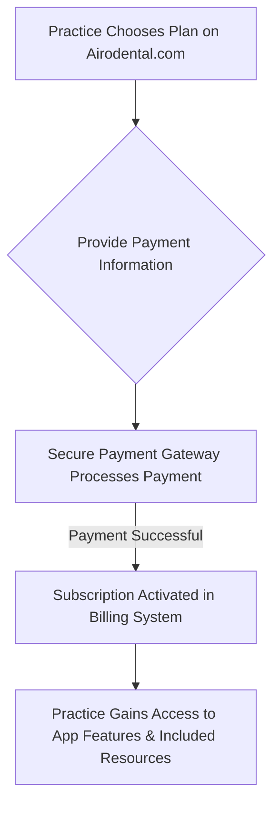
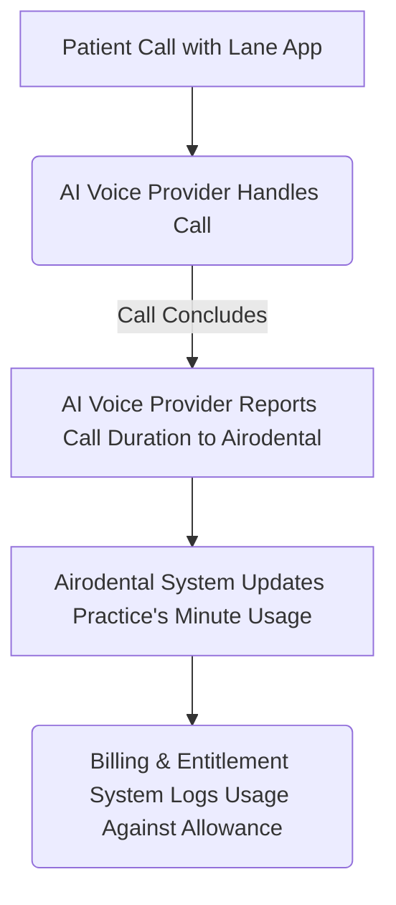
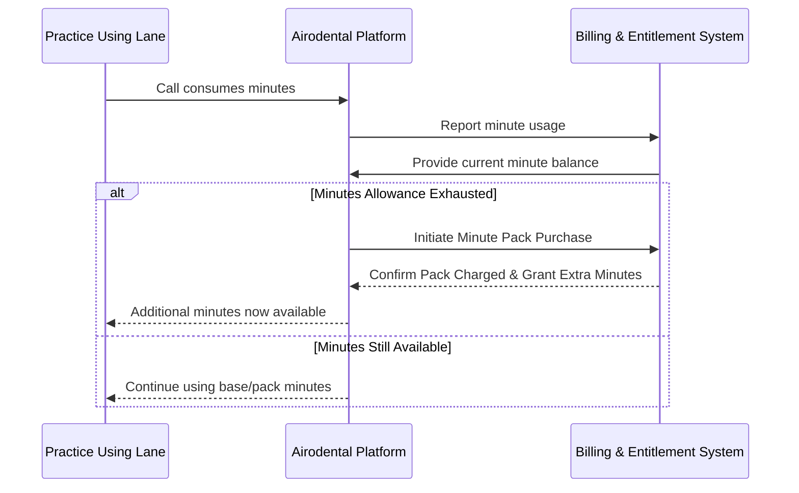

# Airodental Billing System: How It Works

Welcome to Airodental! We're committed to providing cutting-edge AI solutions for dental practices. To make managing your subscriptions and usage as simple and transparent as possible, we've designed a straightforward billing system. This overview explains how it works, especially for our applications like "Lane," the AI Voice Receptionist.

## How Subscriptions Work

Getting started with an Airodental application like Lane is easy:

1.  **Choose Your Plan:** Your practice selects a plan that best fits its needs (e.g., Lane Lite or Lane Pro).
2.  **Secure Payment:** You'll be guided through a secure payment process.
3.  **Activation:** Once payment is confirmed, your subscription is activated, and you gain immediate access to the features included in your chosen plan.

Each plan typically bills monthly and comes with a set amount of resources, like included call minutes for Lane.



## Tracking Your Usage (Example: Lane's Voice Minutes)

We keep track of your resource usage to ensure you always know where you stand. For Lane, this means tracking voice call minutes:

1.  **Call Handled:** When Lane (powered by our AI Voice Provider) handles a call for your practice, the duration is noted.
2.  **System Update:** After the call ends, the AI Voice Provider informs the Airodental system about the call's length.
3.  **Usage Deducted:** Our system then updates your account, deducting the used minutes from your monthly allowance.



## Running Low on Minutes? Automatic Minute Packs

We understand that your call volume can fluctuate. If your practice uses all its included monthly minutes for an application like Lane, our system is designed to help you continue service seamlessly:

*   **Automatic Top-Up:** A "Minute Pack" (e.g., 200 extra minutes for a flat fee of $50) is automatically provisioned to your account.
*   **Immediate Billing:** Your practice is billed for this pack right away, using your payment method on file.
*   **Continued Service:** These extra minutes are immediately available for use for the remainder of your current monthly billing cycle.



## Your Monthly Reset

To keep things simple and predictable:

*   **Fresh Start:** At the beginning of each new monthly billing cycle, your base minute allowance (as per your Lane Lite or Lane Pro plan) is completely reset.
*   **Expiration:** Any unused minutes from the previous month—whether they were part of your base plan or from a purchased Minute Pack—will expire. This policy ensures fair resource allocation and straightforward billing.

```mermaid
graph TD
    A[New Monthly Billing Cycle Begins] --> B[Billing System Processes Subscription Renewal];
    B --> C[Airodental Platform Resets Base Minute Allowance for the Practice];
    C --> D[Any Unused Minutes (Base & Pack) from Previous Cycle Expire];
    D --> E[Practice Starts New Month with Full Base Allowance];
```

## Benefits for Your Practice

*   **Predictable Costs:** Clear, upfront monthly subscription fees.
*   **Uninterrupted Service:** Automatic minute packs mean your AI services keep running even during busy periods.
*   **Flexibility:** Easily accommodate higher call volumes when necessary.
*   **Transparency:** Manage your subscription, view usage, and access billing history anytime through your Airodental portal.

We aim to make your experience with Airodental's AI tools and billing system as smooth and efficient as possible, so you can focus on providing excellent care to your patients.